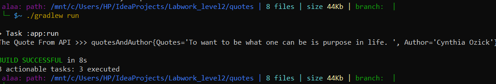
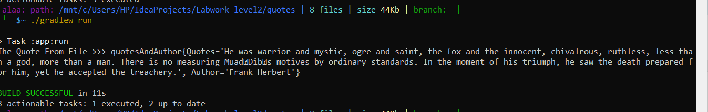

# quotes App 

## The App has :  
* Class **quotesAndAuthor** : use it when we convert from Json Format to Object has a quotes and Author name.  
  
* **ReadJsonFile** Method : take the name of json file as parameter and Return the FileReader for this file.  

* **ArrayOfquotesAndAuthor** Method : take the FileReader as parameter and convert the FileReader to array of class  quotesAndAuthor and Return this Array.  

* **GetRandomNumber** Method : generate a Random number and use it to print random Author and quotes each time the App running.
............... 
* **ReadFromAPI** Method : connect to the API and get the data and use this Method **UpdateOntheJSonFile** , if catch Exception then will Read From Json File.   
* **UpdateOntheJSonFile** Method : Read the json file and get the array of objects from this file "ArrayOfquotesAndAuthor Method"  
      create a new array in bigger size to add the new data we got from the API  
      Write the Array toJson in the File For using if the connection not established  
* **ReadFromJsonFileUpdated** Method : Read the json file and return randome object from it if there is problem in connect to the API.  

## How the App work ? 
* connect to the API and get the json data and print the quotes and Author.   
  
* Update on the Json file and add this data on it.  
* If there is a problem in the connection then will read from the json File and print a random quotes and Author.  
  

  

