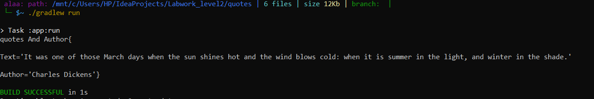
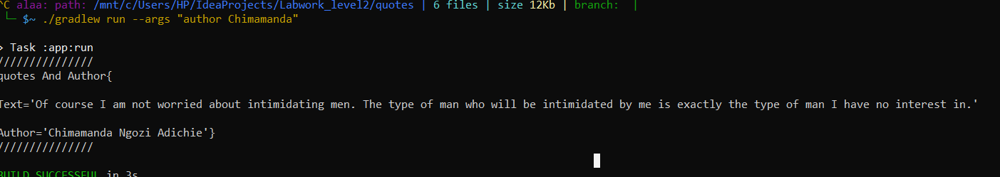
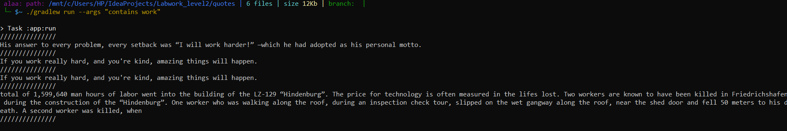

# quotes App 

## The App has :  
* Class **quotesAndAuthor** : use it when we convert from Json Format to Object has a quotes and Author name.  
  
* **ReadJsonFile** Method : take the name of json file as parameter and Return the FileReader for this file.  

* **ArrayOfquotesAndAuthor** Method : take the FileReader as parameter and convert the FileReader to array of class  quotesAndAuthor and Return this Array.  

* **GetRandomNumber** Method : generate a Random numbet and use it to print random Author and quotes each time the App running.

## How the App work ? 
* Read From the File, Convert Json Format to Object and print object randomly.  
  
  
* Type in an author (on the command line) and return a quote by that author.  
  
   
* type in a word (on the command line) and return a quote that contains that word.  
  

